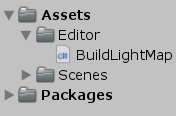
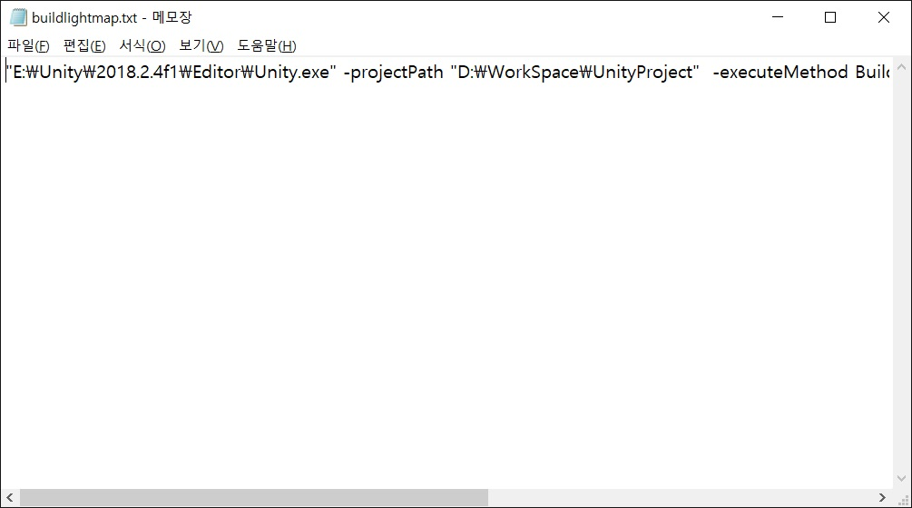

# Unity Lightmap Build With PsExec
Unity LightmapBuild on other local remote with PsExec

Purpose of this project is to make simple unity lightmap build server.

### How to build unity lightmap via cmd

1. Make Unity project. and make script file like below.

> 

2. type the script.
> ```csharp
> using UnityEditor;
> using UnityEngine;
> using UnityEditor.SceneManagement;
> 
> public class BuildLightMap : MonoBehaviour
> {
>     public static void Bake()
>     {
>         string[] scenes = { "Assets/Scenes/SampleScene.unity", "Assets/Scenes/SampleScene2.unity" };
>         var SceneIterator = scenes.GetEnumerator();
>         while (SceneIterator.MoveNext())
>         {
>             EditorSceneManager.OpenScene(SceneIterator.Current as string);
>             Lightmapping.Bake();
>             EditorSceneManager.SaveScene(EditorSceneManager.GetActiveScene());
>         }
>     }
> }
> ```
> before run this script you must make scenes on upward script "scenes" string array have. I think you already know about it.

3. close Unity project and open cmd as an Administrator. type below.
> ```
> >> "Your Unity.exe Path" -projectPath "Your UnityProject Path"  -executeMethod static_function_you_want_run -quit -batchmode -username "Your Unity ID" -password "Your Unity Passward"
> ```
> on upward command you can run static function BuildLightMap.Bake().
> This is example.
> ```
> >> "E:\Unity\2018.2.4f1\Editor\Unity.exe" -projectPath "D:\WorkSpace\UnityProject" -executeMethod BuildLightMap.Bake -quit -batchmode -username "user@gmail.com" -password "password"
> ```

### Make it as batch file
1. It is very annoying to type upward command whenever you build lightmap. so we make it as executable command file.
> [What is batch file?](https://en.wikipedia.org/wiki/Batch_file)<br>
> [learn batch](https://www.tutorialspoint.com/batch_script/)

2. Make txt file on your Unity Project Path. and type command we use before on **"How to build unity lightmap via cmd"** number3.
> 

3. Change txt file extension to .bat
> 

4. Now you can bake lightmap by execute this batch file!
